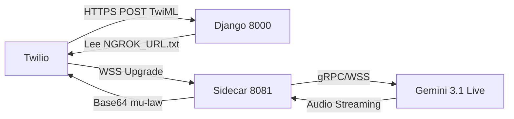

# INFRAESTRUCTURA DE VOZ MULTI-SALTO (ABRIL 2026)
# VOICE INFRASTRUCTURE MULTI-HOP (APRIL 2026)
---
# Documentación técnica de la topología de red para voz en tiempo real.
# Technical documentation of the network topology for real-time voice.

## 1. Topología de Conectividad / Connectivity Topology
La arquitectura de EnterpriseBot utiliza un modelo de cuatro nodos para garantizar la baja latencia en el procesamiento de audio A2A (Audio-to-Audio).
The EnterpriseBot architecture uses a four-node model to ensure low latency in A2A (Audio-to-Audio) processing.

1.  **Twilio (PSTN/SIP):** Origen de la llamada. Transmite audio en G.711 mu-law (8kHz) empaquetado en JSON vía WebSocket.
2.  **Ngrok v3 (Túnel Seguro):** Actúa como proxy reverso dinámico. Expone el puerto `8081` de PythonAnywhere al mundo exterior. La URL se persiste en `NGROK_URL.txt`.
3.  **Sidecar Bridge (aiohttp @ 8081):** Ejecutándose en PythonAnywhere. Es el único punto de entrada para el tráfico de voz. Gestiona la concurrencia asíncrona fuera del ciclo WSGI de Django.
4.  **Google GenAI SDK (Gemini 3.1 Live):** Endpoint final. Recibe PCM Linear 16-bit a través del context manager `client.aio.live.connect`.

## 2. Flujo de Datos Lógico / Logical Data Flow

## 3. Persistencia de Sesión / Session Persistence
El archivo `DOCS/SESSION/NGROK_URL.txt` es el "Single Source of Truth" para el túnel. Tanto la vista de Django (`InboundCallView`) como el `UniversalVoiceBridge` consultan este archivo para garantizar que el TwiML generado siempre apunte al túnel activo.
The `DOCS/SESSION/NGROK_URL.txt` file is the "Single Source of Truth" for the tunnel. Both the Django view (`InboundCallView`) and the `UniversalVoiceBridge` consult this file to ensure that the generated TwiML always points to the active tunnel.
